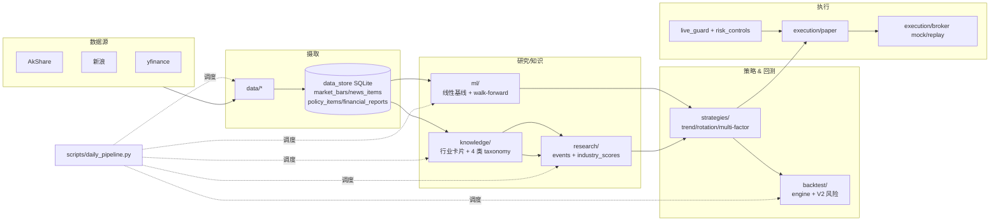
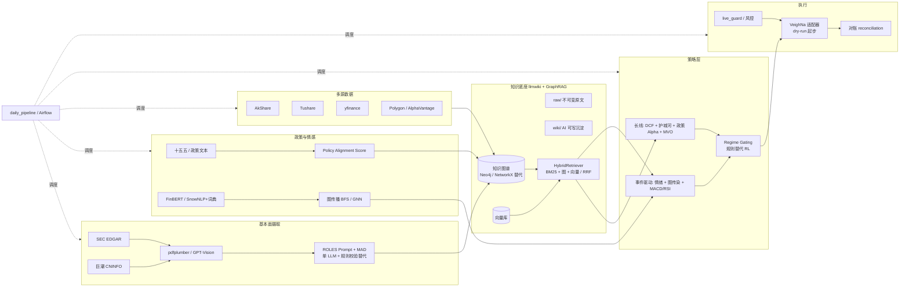

# Architecture Overview

## Current modules

1. **data/**: market/news/fundamental data fetching and cache.
2. **strategies/**: signal generation (trend, rotation, multi-factor).
3. **backtest/**: backtest engine and risk controls.
4. **execution/**: paper trading execution and order lifecycle.
5. **scripts/**: daily report, dashboard, strategy runners.
6. **utils/**: config, retry, notification helpers.

## Data flow

1. Fetch market/news/fundamental data from providers (`data/*`).
2. Clean/validate input data (`data/quality.py`).
3. Build strategy signals (`strategies/*`).
4. Evaluate via backtest (`backtest/*`) or paper account (`execution/*`).
5. Publish artifacts via dashboard and daily report (`scripts/*`).

## Phase-0 boundaries

This phase keeps existing behavior and introduces explicit extension boundaries:

- **data_store/**: persistent storage and repositories for structured datasets.
- **knowledge/**: industry taxonomy, source docs, and knowledge cards.
- **research/**: event extraction, industry scoring, leaderboards/reports.
- **ml/**: feature/label dataset, model training and evaluation.

These modules are introduced as package boundaries first, then implemented in next phases.

## 当前架构（已实现）

## 目标架构（方案蓝图）

## 落地策略

- 详见 `docs/落地全景计划.md`：把目标架构按 Phase 0–6 拆分，重型组件（Neo4j / GPT-Vision / MAD / FinBERT / GNN / VeighNa / RL）先用轻量方案落地，验证闭环后再升级。

## Phase 1 实际落点（已实现）

- 文件层：`llmwiki/{raw,wiki}/` + `llmwiki/CLAUDE.md`（4 类节点 / 5 类边 / 写入规则）。
- 持久化：`data_store` 新增 `knowledge_nodes / knowledge_edges / knowledge_evidence` 三表（含索引）。
- 内存图：`knowledge/graph.py` 的 `IndustryGraph`（NetworkX DiGraph + upsert + neighbors + save/load）；旧 `build_industry_graph(taxonomy, leaders)` 函数签名保留。
- 抽取：`knowledge/extractors.py` 规则 NER（公司词典 + taxonomy alias + 政策正则），预留 `LLMEntityExtractor` 接口。
- 检索：`knowledge/retrieval.py` 自实现 `BM25Retriever` + `GraphNeighborRetriever` + `HybridRetriever` (RRF)；`VectorRetriever` 占位。
- 构建脚本：`scripts/build_knowledge_graph.py`，已挂到 `scripts/daily_pipeline.py`（`config.yaml` 中 `knowledge.graph.enabled: false`，默认关闭）。
- 测试：`tests/test_knowledge_graph_phase1.py` 11 用例覆盖向后兼容、upsert 幂等、BFS 邻居、持久化、抽取正负样本、BM25、RRF、Hybrid、增量构建幂等、证据回链。

